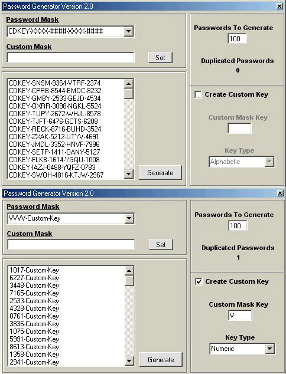



## A\+\+ PASSWORD GENERATOR Version 2\.0 WITH MASKS\(Like in Auto Play Menu Studio\)

### Description

This will create any number of passwords you want with any mask. You can also create custom masks and now custom keys! Also checks to make sure the passwords are unique. Very simple to use. Easily customizable. IF YOU LIKE MY LAST ONE THIS IS A MUST SEE! If you like it please vote and leave feedback.
 
### More Info
 

             |
---                |---
**Submitted On**   |2002-04-15 15:22:30
**By**             |[James Dougherty](https://github.com/Planet-Source-Code/PSCIndex/blob/master/ByAuthor/james-dougherty.md)
**Level**          |Intermediate
**User Rating**    |4.5 (36 globes from 8 users)
**Compatibility**  |VB 6\.0
**Category**       |[Miscellaneous](https://github.com/Planet-Source-Code/PSCIndex/blob/master/ByCategory/miscellaneous__1-1.md)
**World**          |[Visual Basic](https://github.com/Planet-Source-Code/PSCIndex/blob/master/ByWorld/visual-basic.md)
**Archive File**   |[A\+\+\_PASSWO722854152002\.zip](https://github.com/Planet-Source-Code/james-dougherty-a-password-generator-version-2-0-with-masks-like-in-auto-play-menu-studio__1-33840/archive/master.zip)

